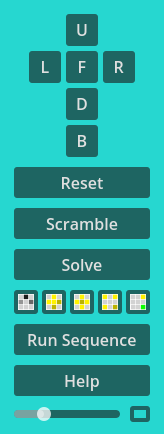
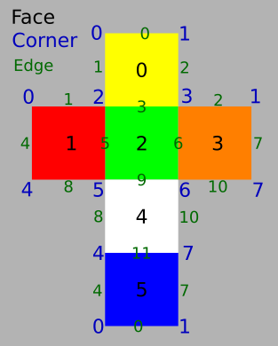

# Cubic
Godot 4 Rubik Cube Simulator

Downloads: [Cubic - Rubik Cube Simulator on Itch.io](https://andrew-wilkes.itch.io/cubic)

## Camera Control

Move around the cube by holding the left mouse button and moving the mouse.

The camera is rotated around its x-axis followed by its y-axis.

Hold down the CTRL key and left mouse button to zoom when moving the mouse.

## UI Control Panel

The various faces of the cube are related as per the forward view on the screen. So the side to the left is the left side of the cube whatever the rotation of the camera view. So the L button rotates the left side of the cube.

Left-click a button to rotate the related face of the cube by 90 degrees in the clockwise direction.

Shift-left-click to rotate the face in the counter-clockwise direction. Or right-click the button.

Ctrl-click on a face button to make the camera look at that face.

The *Reset* button restores the faces of the cube to the *solved* positions.

The *Scramble* button causes the cube faces to be rotated randomly to scramble the puzzle.

The *Solve* button initiates a solving animation that may be stepped through, played, paused or stopped to learn how to solve a cube puzzle.

The *Run Sequence* button opens a panel that lists some sequences of moves that may be played.

## Color Map

This will be used to edit and track the state of the faces of the cube. For example: to copy the state of a physical Rubik Cube in order to run the solver on it. Or to copy the image for reference.

Click on a cell (it is shaded darker), then click on another cell to try to move the first cell to the new position. If the move is valid, other cells will also be updated to reflect the changed positions of the puzzle pieces.

## Coordinate System

This is used to assign index values to the various faces, edges, and corners for use when programming the code.

